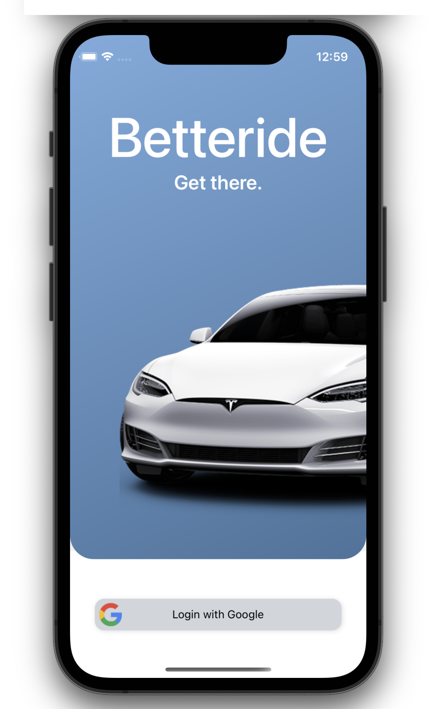
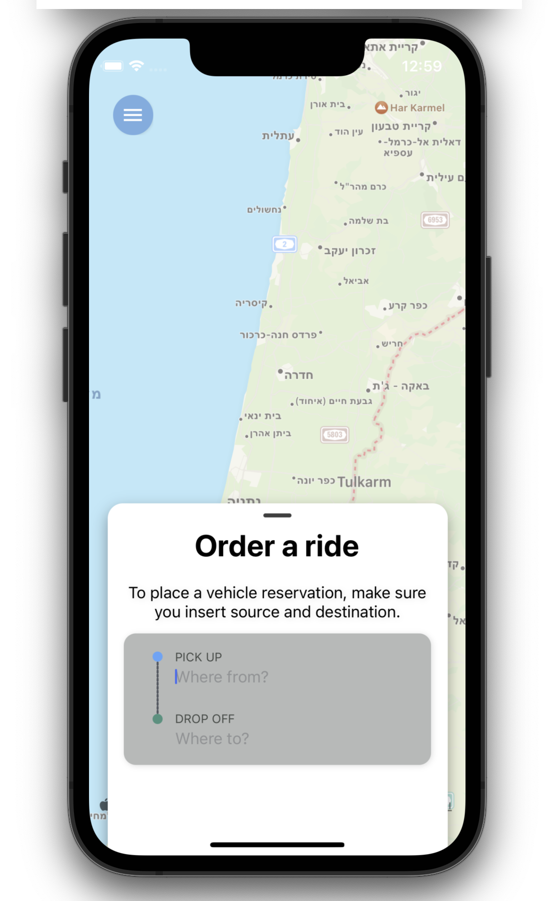
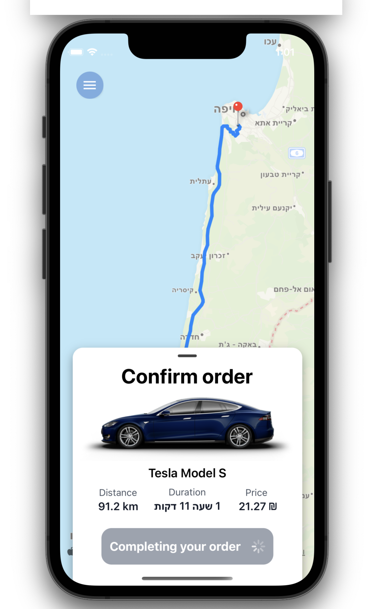
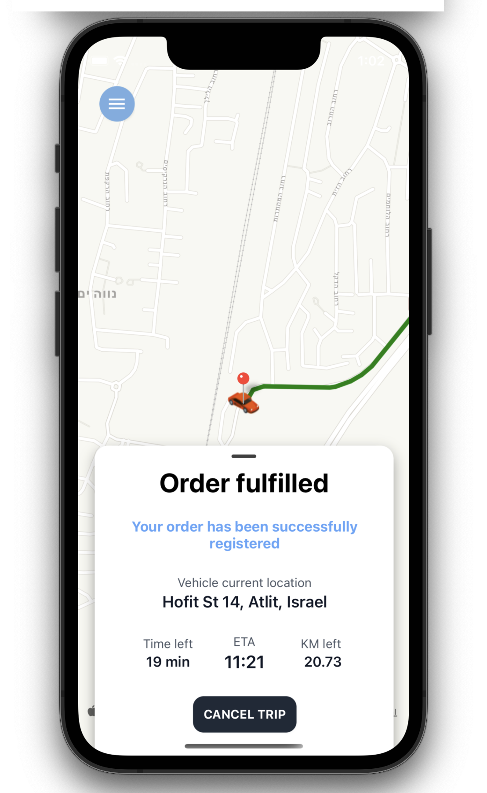
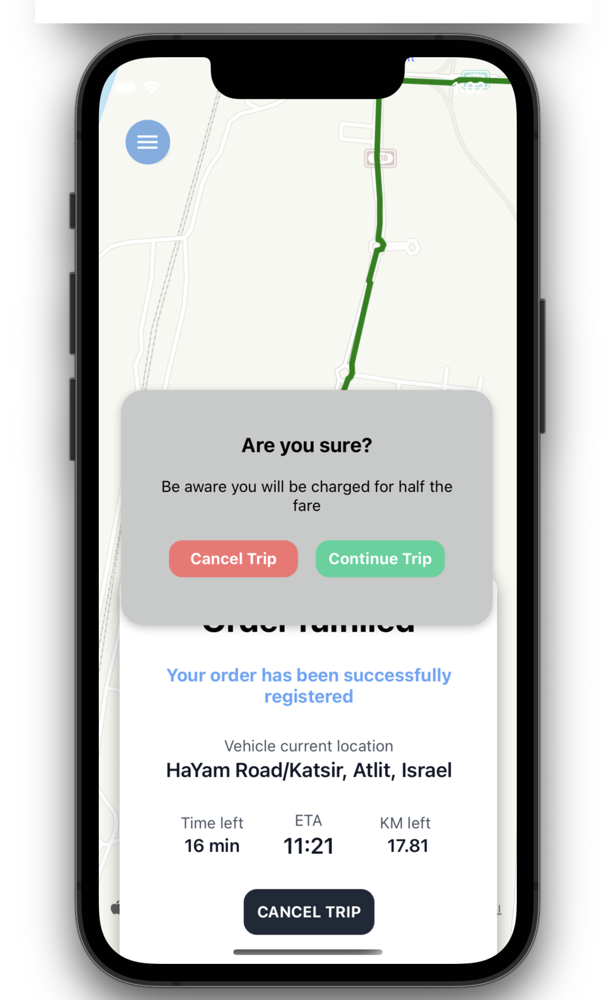
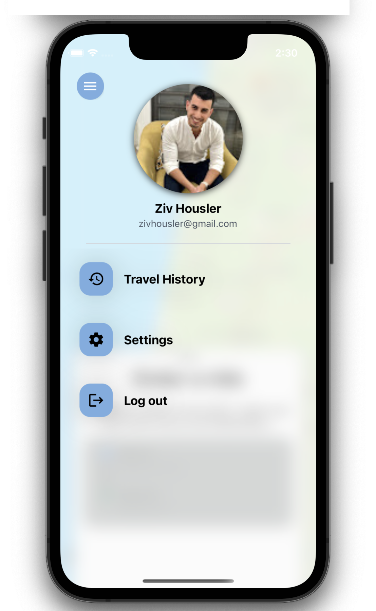
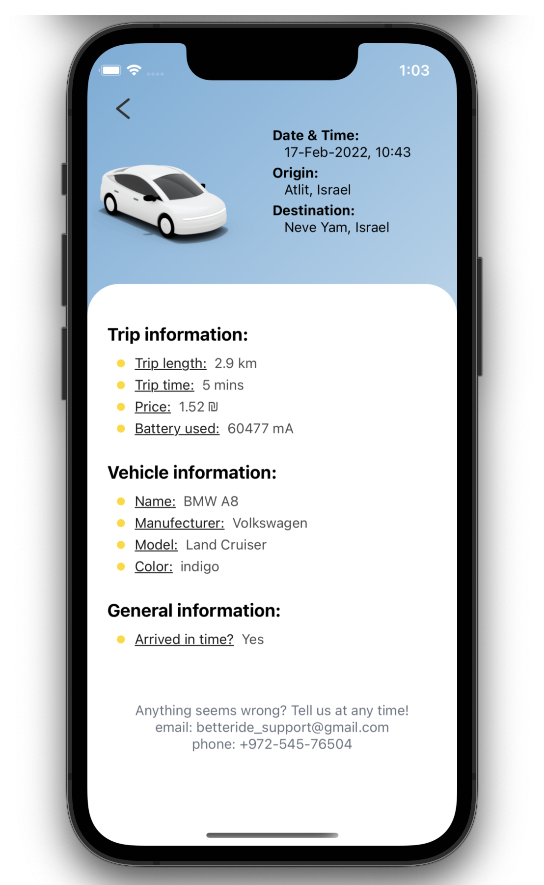

# Betteride

Betteride is a ride-hailing app that matches users with electric automated cars. The app is designed to be user-friendly and convenient, with a focus on providing a good user experience.

# What can the application do?

To use Betteride, simply open the app and enter your destination. The app will then automatically select the best vehicle for you based on a number of factors, such as your location, the number of passengers, and the time of day.
Once the app has selected a vehicle, you can track its location and send you notifications when it is on its way. You can also use the app to track your ride in real time.
When you arrive at your destination, the app will automatically calculate the fare and charge your payment method. You can also rate and review your driver from the app.

⭐ Features:

1. Easy to use interface
2. Real-time tracking of vehicles
3. Automated payment system

🏅 Benefits:

1. Convenient and reliable transportation
2. Environmentally friendly
3. Affordable
4. Safe and secure
5. 24/7 availability

📷 Screenshots:
 

